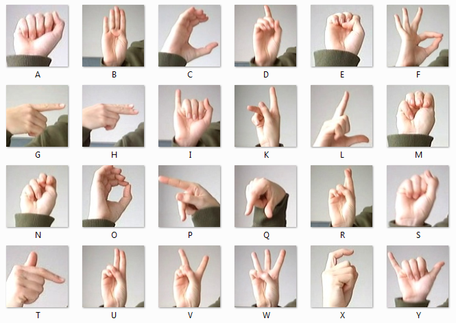

# Training Repository
This is a repository that contains code for training a machine learning model using Jupyter Notebook

The datasets can be obtained [here](https://drive.google.com/file/d/1Ao60X-dVDcBevhsRkflmcUeBi-Z7KQtB/view?usp=sharing)

This is the ASL Language(26 classes + 1 class for "space" letters):

  

